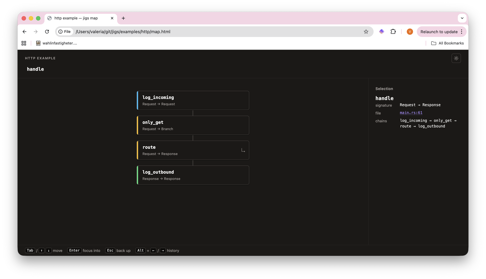

# jigs

> ⚠️ **Very early stage.** This project is in active, exploratory development and is nowhere close to being production ready. APIs will change, things will break, and entire ideas may be thrown out. Star it, watch it, play with it — but don't ship it.

A jig is a custom-made tool that controls the location or motion of other tools.

HTTP handlers, RPC services, agentic workflows, data pipelines and even event listeners all have the same shape: something comes in and, after several steps, something comes out.

And the more steps there are in this process, the harder it becomes to debug, fix and maintain the code that does it.

So `jigs` is a small Rust framework that lets you be explicit about your processing steps and write your code like this:

```rust
#[jig]
fn handle(request: Request) -> Response {
    request
        .then(log_incoming)
        .then(set_auth_state)
        .then(route_to_feature)
        .then(log_response)
}
```

Every step is a `jig` too, so you can compose processing pipelines of virtually any size.

The main advantage, though, is that `jigs` generates a graph of your codebase at compile time and lets you navigate it with ease.



Try the [interactive examples](https://valeriavg.github.io/jigs/#examples) — each one is a real map rendered from an example crate in this repo.

## Install

```sh
cargo add jigs
```

To enable per-step tracing, turn on the `trace` feature:

```sh
cargo add jigs --features trace
```

## Quickstart

```rust
use jigs::{jig, Request, Response};

#[jig]
fn validate(r: Request<u32>) -> Request<u32> { r }

#[jig]
fn handle(r: Request<u32>) -> Response<String> {
    Response::ok(format!("got {}", r.0))
}

fn main() {
    let response = Request(42u32).then(validate).then(handle);
    assert_eq!(response.inner.unwrap(), "got 42");
}
```

There are four kinds of jigs, distinguished by their input and output types:

| Input      | Output            | Purpose                          |
| ---------- | ----------------- | -------------------------------- |
| `Request`  | `Request`         | enrich, validate, transform      |
| `Request`  | `Response`        | terminal handler                 |
| `Response` | `Response`        | post-process the outgoing message|
| `Request`  | `Branch<Req,Resp>`| guard that may short-circuit     |

The type system enforces ordering: once you hold a `Response`, you cannot chain a jig that expects a `Request`. Errored responses and `Branch::Done` short-circuit the rest of the pipeline.

See [`examples/`](./examples) for sync, async, HTTP, and a multithreaded [todo API](./examples/todo-api) that demonstrates fork-based routing at multiple nesting depths.

For multi-arm dispatch use `fork!`. First matching predicate wins, `_` is the default:

```rust
#[jig]
fn route(req: Request<HttpRequest>) -> Response<String> {
    fork!(req,
        |r: &HttpRequest| r.path == "/"                  => root,
        |r: &HttpRequest| r.path.starts_with("/hello/")  => hello,
        _ => not_found,
    )
}
```

## Generate a map

Every `#[jig]` registers itself in a global inventory at link time, so you can render an interactive HTML map and a Markdown/Mermaid version straight from your code — no scanning, no build script.

```rust
use jigs::{jig, Request, Response};

#[jig]
fn validate(r: Request<u32>) -> Request<u32> { r }

#[jig]
fn handle(r: Request<u32>) -> Response<String> {
    Response::ok(format!("got {}", r.0))
}

fn main() -> std::io::Result<()> {
    let dir = env!("CARGO_MANIFEST_DIR");
    std::fs::write(
        format!("{dir}/map.html"),
        jigs::map::to_html(Some("handle"), "my service", None),
    )?;
    std::fs::write(
        format!("{dir}/map.md"),
        jigs::map::to_markdown(Some("handle"), "my service"),
    )?;
    Ok(())
}
```

The third argument to `to_html` is an optional editor URL template; pass e.g. `Some("vscodium://file/{path}:{line}")` for VSCodium, `vscode://file/{path}:{line}` for VS Code or Cursor, `idea://open?file={path}&line={line}` for JetBrains IDEs. With `None` the link falls back to `file://` and opens with your OS default.

The Markdown form embeds a Mermaid flowchart that renders inline on GitHub — see [`examples/http/map.md`](./examples/http/map.md).

## Trace the exact steps in runtime

Things break, and the bigger the system, the harder it is to figure out where exactly things went wrong. `jigs` lets you pinpoint an error or a bottleneck with ease:
```
log_incoming     ✓  0.1ms
set_auth_state   ✓  2.3ms
route_to_feature ✗  ERROR 500
  └─ validate_route  ✓  0.4ms
  └─ check_permissions ✗  ERROR: DB Timeout
```

With the `trace` feature on, drain the per-thread buffer and render it in
either of two formats:

```rust
let entries = jigs::trace::take();
print!("{}", jigs::log::render_tree(&entries));   // human-readable
print!("{}", jigs::log::render_ndjson(&entries)); // one JSON object per line
```

The NDJSON form is meant for automated log ingestion; each line carries
`name`, `depth`, `duration_ns`, `ok` and an optional `error` message.

## Everything agnostic

`jigs` works with any existing or future framework that has two distinct types for incoming and outbound messages. Check the [examples](./examples) to see it in action.

## Roadmap
- [x] Basic functionality
- [x] Time tracing (behind the `trace` feature)
- [x] Logging utils (tree + NDJSON via `jigs-log`)
- [x] Generation of interactive map at compile time ([see above](#generate-a-map))
- [x] Add more complex examples (see [`examples/todo-api`](./examples/todo-api))

## Maybe Roadmap
- IDE extension to view jigs in the editor
- Terminal jigs-map
- Runtime tracing with interactive map
- Ability to trace and view remote jigs services as one system

## License

MIT — see [LICENSE](./LICENSE).
