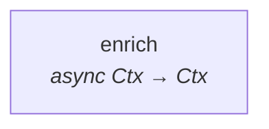

# async example

```mermaid
flowchart TD
  enrich["enrich<br/><i>async Ctx → Ctx</i>"]


  %% shape legend: rect = Request → Request, rhombus = switching (Request → Response/Branch), stadium = Response → Response
```
