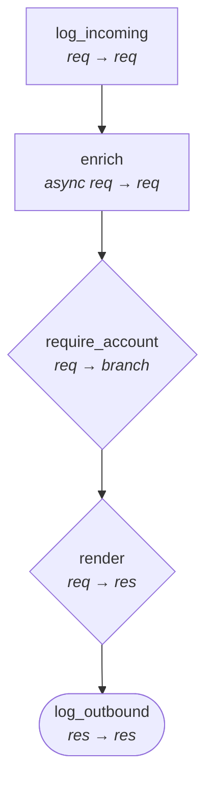

# async example

```mermaid
flowchart TD
  log_incoming["log_incoming<br/><i>req → req</i>"]
  enrich["enrich<br/><i>async req → req</i>"]
  require_account{"require_account<br/><i>req → branch</i>"}
  render{"render<br/><i>req → res</i>"}
  log_outbound(["log_outbound<br/><i>res → res</i>"])

log_incoming --> enrich
enrich --> require_account
require_account --> render
render --> log_outbound

  %% shape legend: rect = Request → Request, rhombus = switching (Request → Response/Branch), stadium = Response → Response
```
