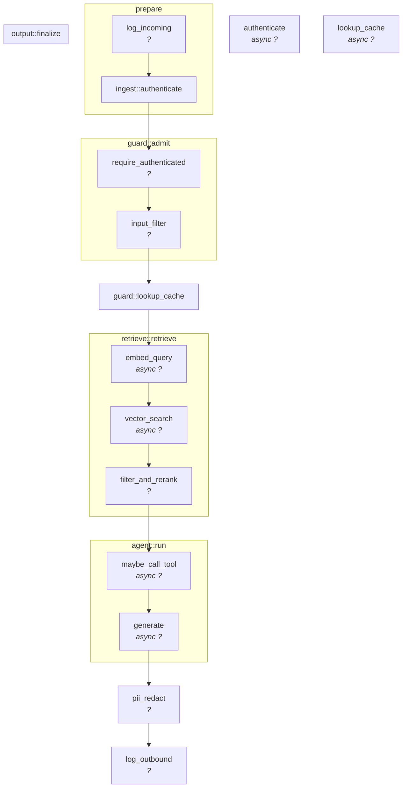

# cf-rag example

```mermaid
flowchart TD
  log_incoming["log_incoming<br/><i>?</i>"]
  authenticate["authenticate<br/><i>async ?</i>"]
  require_authenticated["require_authenticated<br/><i>?</i>"]
  input_filter["input_filter<br/><i>?</i>"]
  lookup_cache["lookup_cache<br/><i>async ?</i>"]
  embed_query["embed_query<br/><i>async ?</i>"]
  vector_search["vector_search<br/><i>async ?</i>"]
  filter_and_rerank["filter_and_rerank<br/><i>?</i>"]
  maybe_call_tool["maybe_call_tool<br/><i>async ?</i>"]
  generate["generate<br/><i>async ?</i>"]
  pii_redact["pii_redact<br/><i>?</i>"]
  log_outbound["log_outbound<br/><i>?</i>"]

ingest::authenticate --> require_authenticated
input_filter --> guard::lookup_cache
guard::lookup_cache --> embed_query
filter_and_rerank --> maybe_call_tool
generate --> pii_redact
pii_redact --> log_outbound
  subgraph prepare ["prepare"]
    direction TB
    log_incoming --> ingest::authenticate
  end
  subgraph guard::admit ["guard::admit"]
    direction TB
    require_authenticated --> input_filter
  end
  subgraph retrieve::retrieve ["retrieve::retrieve"]
    direction TB
    embed_query --> vector_search
    vector_search --> filter_and_rerank
  end
  subgraph agent::run ["agent::run"]
    direction TB
    maybe_call_tool --> generate
  end
  subgraph output::finalize ["output::finalize"]
    direction TB
  end

  %% shape legend: rect = Request → Request, rhombus = switching (Request → Response/Branch), stadium = Response → Response
```
