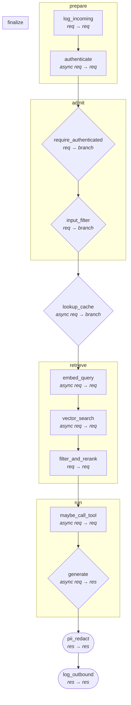

# cf-rag example

```mermaid
flowchart TD
  log_incoming["log_incoming<br/><i>req → req</i>"]
  authenticate["authenticate<br/><i>async req → req</i>"]
  require_authenticated{"require_authenticated<br/><i>req → branch</i>"}
  input_filter{"input_filter<br/><i>req → branch</i>"}
  lookup_cache{"lookup_cache<br/><i>async req → branch</i>"}
  embed_query["embed_query<br/><i>async req → req</i>"]
  vector_search["vector_search<br/><i>async req → req</i>"]
  filter_and_rerank["filter_and_rerank<br/><i>req → req</i>"]
  maybe_call_tool["maybe_call_tool<br/><i>async req → req</i>"]
  generate{"generate<br/><i>async req → res</i>"}
  pii_redact(["pii_redact<br/><i>res → res</i>"])
  log_outbound(["log_outbound<br/><i>res → res</i>"])

authenticate --> require_authenticated
input_filter --> lookup_cache
lookup_cache --> embed_query
filter_and_rerank --> maybe_call_tool
generate --> pii_redact
pii_redact --> log_outbound
  subgraph prepare ["prepare"]
    direction TB
    log_incoming --> authenticate
  end
  subgraph admit ["admit"]
    direction TB
    require_authenticated --> input_filter
  end
  subgraph retrieve ["retrieve"]
    direction TB
    embed_query --> vector_search
    vector_search --> filter_and_rerank
  end
  subgraph run ["run"]
    direction TB
    maybe_call_tool --> generate
  end
  subgraph finalize ["finalize"]
    direction TB
  end

  %% shape legend: rect = Request → Request, rhombus = switching (Request → Response/Branch), stadium = Response → Response
```
