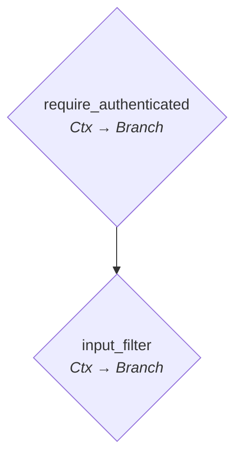

# cf-rag example

```mermaid
flowchart TD
  require_authenticated{"require_authenticated<br/><i>Ctx → Branch<Ctx,AgentOutput></i>"}
  input_filter{"input_filter<br/><i>Ctx → Branch<Ctx,AgentOutput></i>"}

require_authenticated --> input_filter

  %% shape legend: rect = Request → Request, rhombus = switching (Request → Response/Branch), stadium = Response → Response
```
