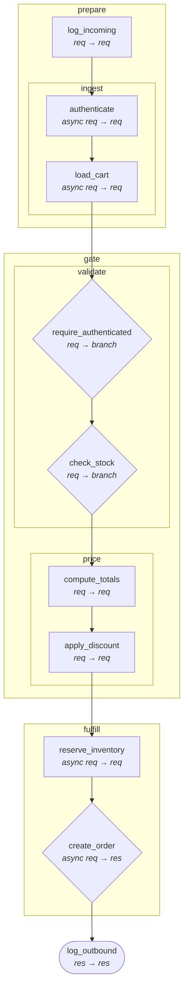

# checkout example

```mermaid
flowchart TD
  log_incoming["log_incoming<br/><i>req → req</i>"]
  authenticate["authenticate<br/><i>async req → req</i>"]
  load_cart["load_cart<br/><i>async req → req</i>"]
  require_authenticated{"require_authenticated<br/><i>req → branch</i>"}
  check_stock{"check_stock<br/><i>req → branch</i>"}
  compute_totals["compute_totals<br/><i>req → req</i>"]
  apply_discount["apply_discount<br/><i>req → req</i>"]
  reserve_inventory["reserve_inventory<br/><i>async req → req</i>"]
  create_order{"create_order<br/><i>async req → res</i>"}
  log_outbound(["log_outbound<br/><i>res → res</i>"])

load_cart --> require_authenticated
apply_discount --> reserve_inventory
create_order --> log_outbound
  subgraph prepare ["prepare"]
    direction TB
    log_incoming --> authenticate
    subgraph ingest ["ingest"]
      direction TB
      authenticate --> load_cart
    end
  end
  subgraph gate ["gate"]
    direction TB
    check_stock --> compute_totals
    subgraph validate ["validate"]
      direction TB
      require_authenticated --> check_stock
    end
    subgraph price ["price"]
      direction TB
      compute_totals --> apply_discount
    end
  end
  subgraph fulfill ["fulfill"]
    direction TB
    reserve_inventory --> create_order
  end

  %% shape legend: rect = Request → Request, rhombus = switching (Request → Response/Branch), stadium = Response → Response
```
