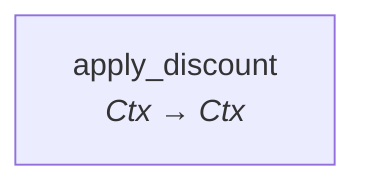

# checkout example

```mermaid
flowchart TD
  apply_discount["apply_discount<br/><i>Ctx → Ctx</i>"]


  %% shape legend: rect = Request → Request, rhombus = switching (Request → Response/Branch), stadium = Response → Response
```
