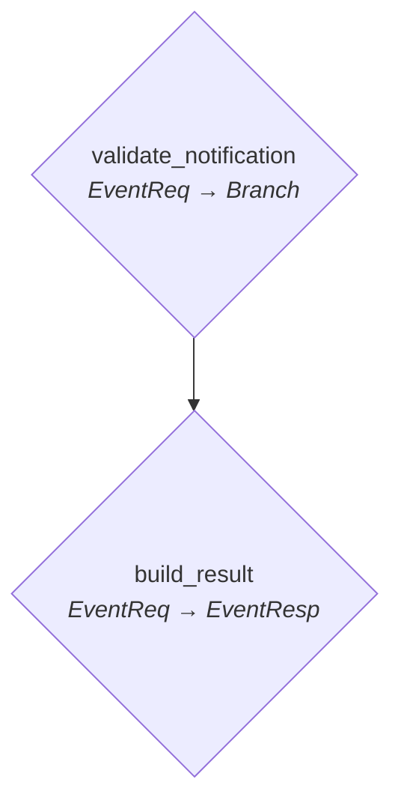

# events bus example

```mermaid
flowchart TD
  validate_notification{"validate_notification<br/><i>EventReq → Branch<EventReq,EventResp></i>"}
  build_result{"build_result<br/><i>EventReq → EventResp</i>"}

validate_notification --> build_result

  %% shape legend: rect = Request → Request, rhombus = switching (Request → Response/Branch), stadium = Response → Response
```
