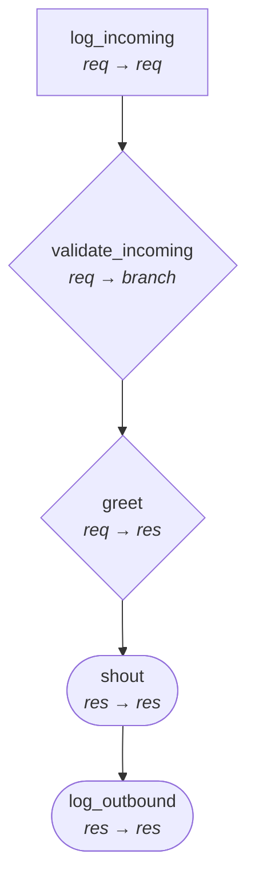

# hello example

```mermaid
flowchart TD
  log_incoming["log_incoming<br/><i>req → req</i>"]
  validate_incoming{"validate_incoming<br/><i>req → branch</i>"}
  greet{"greet<br/><i>req → res</i>"}
  shout(["shout<br/><i>res → res</i>"])
  log_outbound(["log_outbound<br/><i>res → res</i>"])

log_incoming --> validate_incoming
validate_incoming --> greet
greet --> shout
shout --> log_outbound

  %% shape legend: rect = Request → Request, rhombus = switching (Request → Response/Branch), stadium = Response → Response
```
