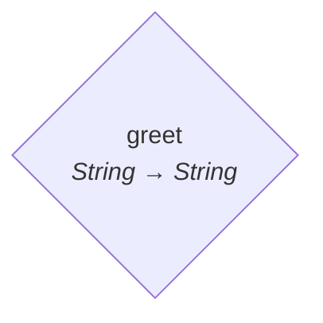

# hello example

```mermaid
flowchart TD
  greet{"greet<br/><i>String → String</i>"}


  %% shape legend: rect = Request → Request, rhombus = switching (Request → Response/Branch), stadium = Response → Response
```
