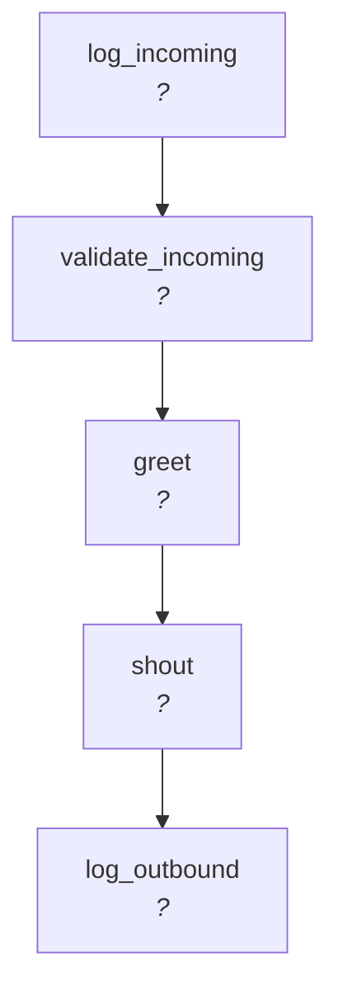

# hello example

```mermaid
flowchart TD
  log_incoming["log_incoming<br/><i>?</i>"]
  validate_incoming["validate_incoming<br/><i>?</i>"]
  greet["greet<br/><i>?</i>"]
  shout["shout<br/><i>?</i>"]
  log_outbound["log_outbound<br/><i>?</i>"]

log_incoming --> validate_incoming
validate_incoming --> greet
greet --> shout
shout --> log_outbound

  %% shape legend: rect = Request → Request, rhombus = switching (Request → Response/Branch), stadium = Response → Response
```
