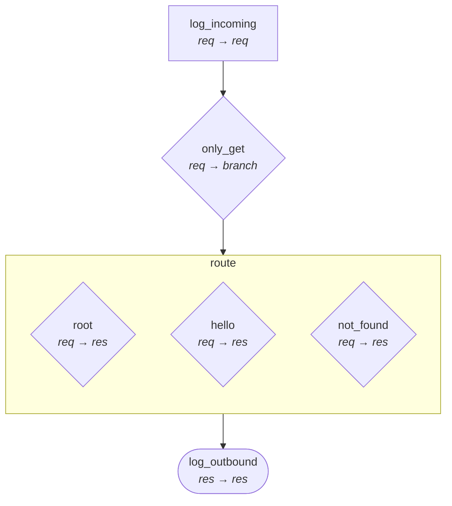

# http example

```mermaid
flowchart TD
  log_incoming["log_incoming<br/><i>req → req</i>"]
  only_get{"only_get<br/><i>req → branch</i>"}
  root{"root<br/><i>req → res</i>"}
  hello{"hello<br/><i>req → res</i>"}
  not_found{"not_found<br/><i>req → res</i>"}
  log_outbound(["log_outbound<br/><i>res → res</i>"])

log_incoming --> only_get
only_get --> route
route --> log_outbound
  subgraph route ["route"]
    direction TB
    root
    hello
    not_found
  end

  %% shape legend: rect = Request → Request, rhombus = switching (Request → Response/Branch), stadium = Response → Response
```
