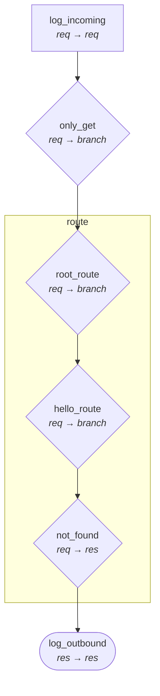

# http example

```mermaid
flowchart TD
  log_incoming["log_incoming<br/><i>req → req</i>"]
  only_get{"only_get<br/><i>req → branch</i>"}
  root_route{"root_route<br/><i>req → branch</i>"}
  hello_route{"hello_route<br/><i>req → branch</i>"}
  not_found{"not_found<br/><i>req → res</i>"}
  log_outbound(["log_outbound<br/><i>res → res</i>"])

log_incoming --> only_get
only_get --> root_route
not_found --> log_outbound
  subgraph route ["route"]
    direction TB
    root_route --> hello_route
    hello_route --> not_found
  end

  %% shape legend: rect = Request → Request, rhombus = switching (Request → Response/Branch), stadium = Response → Response
```
