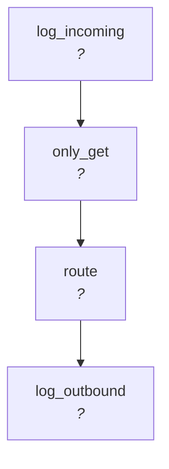

# http example

```mermaid
flowchart TD
  log_incoming["log_incoming<br/><i>?</i>"]
  only_get["only_get<br/><i>?</i>"]
  route["route<br/><i>?</i>"]
  log_outbound["log_outbound<br/><i>?</i>"]

log_incoming --> only_get
only_get --> route
route --> log_outbound

  %% shape legend: rect = Request → Request, rhombus = switching (Request → Response/Branch), stadium = Response → Response
```
