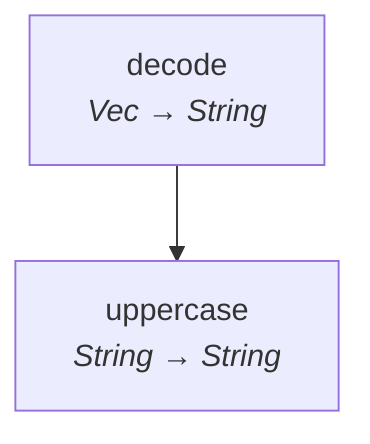

# library example

```mermaid
flowchart TD
  decode["decode<br/><i>Vec<u8> → String</i>"]
  uppercase["uppercase<br/><i>String → String</i>"]

decode --> uppercase

  %% shape legend: rect = Request → Request, rhombus = switching (Request → Response/Branch), stadium = Response → Response
```
