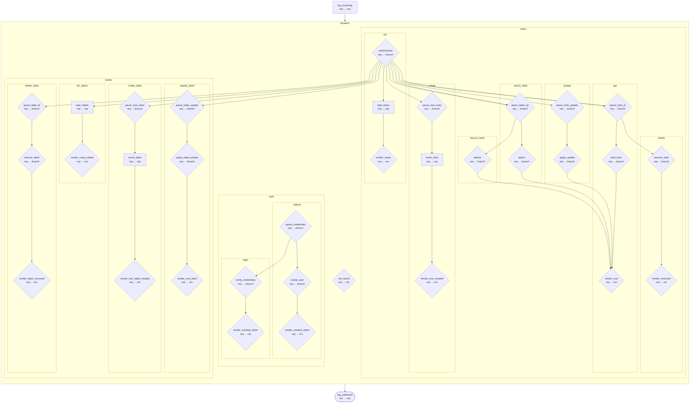

# todo-api example

```mermaid
flowchart TD
  log_incoming["log_incoming<br/><i>req → req</i>"]
  parse_credentials{"parse_credentials<br/><i>req → branch</i>"}
  create_user{"create_user<br/><i>req → branch</i>"}
  render_created_token{"render_created_token<br/><i>req → res</i>"}
  verify_credentials{"verify_credentials<br/><i>req → branch</i>"}
  render_existing_token{"render_existing_token<br/><i>req → res</i>"}
  not_found{"not_found<br/><i>req → res</i>"}
  authenticate{"authenticate<br/><i>req → branch</i>"}
  load_todos["load_todos<br/><i>req → req</i>"]
  render_many{"render_many<br/><i>req → res</i>"}
  parse_new_todo{"parse_new_todo<br/><i>req → branch</i>"}
  insert_todo["insert_todo<br/><i>req → req</i>"]
  render_one_created{"render_one_created<br/><i>req → res</i>"}
  parse_todo_id{"parse_todo_id<br/><i>req → branch</i>"}
  load_todo{"load_todo<br/><i>req → branch</i>"}
  render_one{"render_one<br/><i>req → res</i>"}
  parse_todo_update{"parse_todo_update<br/><i>req → branch</i>"}
  apply_update{"apply_update<br/><i>req → branch</i>"}
  remove_todo{"remove_todo<br/><i>req → branch</i>"}
  render_removed{"render_removed<br/><i>req → res</i>"}
  parse_label_op{"parse_label_op<br/><i>req → branch</i>"}
  attach{"attach<br/><i>req → branch</i>"}
  detach{"detach<br/><i>req → branch</i>"}
  load_labels["load_labels<br/><i>req → req</i>"]
  render_many_labels{"render_many_labels<br/><i>req → res</i>"}
  parse_new_label{"parse_new_label<br/><i>req → branch</i>"}
  insert_label["insert_label<br/><i>req → req</i>"]
  render_one_label_created{"render_one_label_created<br/><i>req → res</i>"}
  parse_label_update{"parse_label_update<br/><i>req → branch</i>"}
  apply_label_update{"apply_label_update<br/><i>req → branch</i>"}
  render_one_label{"render_one_label<br/><i>req → res</i>"}
  parse_label_id{"parse_label_id<br/><i>req → branch</i>"}
  remove_label{"remove_label<br/><i>req → branch</i>"}
  render_label_removed{"render_label_removed<br/><i>req → res</i>"}
  log_outbound(["log_outbound<br/><i>res → res</i>"])

log_incoming --> dispatch
dispatch --> log_outbound
  subgraph dispatch ["dispatch"]
    direction TB
    subgraph auth ["auth"]
      direction TB
      subgraph signup ["signup"]
        direction TB
        parse_credentials --> create_user
        create_user --> render_created_token
      end
      subgraph login ["login"]
        direction TB
        parse_credentials --> verify_credentials
        verify_credentials --> render_existing_token
      end
    end
    subgraph todos ["todos"]
      direction TB
      subgraph list ["list"]
        direction TB
        authenticate --> load_todos
        load_todos --> render_many
      end
      subgraph create ["create"]
        direction TB
        authenticate --> parse_new_todo
        parse_new_todo --> insert_todo
        insert_todo --> render_one_created
      end
      subgraph get ["get"]
        direction TB
        authenticate --> parse_todo_id
        parse_todo_id --> load_todo
        load_todo --> render_one
      end
      subgraph update ["update"]
        direction TB
        authenticate --> parse_todo_update
        parse_todo_update --> apply_update
        apply_update --> render_one
      end
      subgraph delete ["delete"]
        direction TB
        authenticate --> parse_todo_id
        parse_todo_id --> remove_todo
        remove_todo --> render_removed
      end
      subgraph attach_label ["attach_label"]
        direction TB
        authenticate --> parse_label_op
        parse_label_op --> attach
        attach --> render_one
      end
      subgraph detach_label ["detach_label"]
        direction TB
        authenticate --> parse_label_op
        parse_label_op --> detach
        detach --> render_one
      end
    end
    subgraph labels ["labels"]
      direction TB
      subgraph list_labels ["list_labels"]
        direction TB
        authenticate --> load_labels
        load_labels --> render_many_labels
      end
      subgraph create_label ["create_label"]
        direction TB
        authenticate --> parse_new_label
        parse_new_label --> insert_label
        insert_label --> render_one_label_created
      end
      subgraph update_label ["update_label"]
        direction TB
        authenticate --> parse_label_update
        parse_label_update --> apply_label_update
        apply_label_update --> render_one_label
      end
      subgraph delete_label ["delete_label"]
        direction TB
        authenticate --> parse_label_id
        parse_label_id --> remove_label
        remove_label --> render_label_removed
      end
    end
    not_found
  end

  %% shape legend: rect = Request → Request, rhombus = switching (Request → Response/Branch), stadium = Response → Response
```
