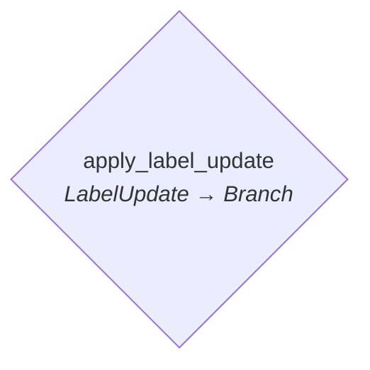

# todo-api example

```mermaid
flowchart TD
  apply_label_update{"apply_label_update<br/><i>LabelUpdate → Branch<OneLabel,HttpResponse></i>"}


  %% shape legend: rect = Request → Request, rhombus = switching (Request → Response/Branch), stadium = Response → Response
```
