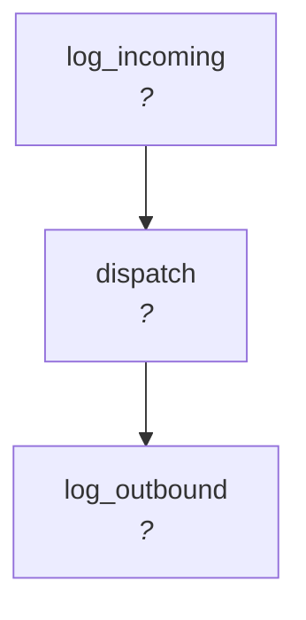

# todo-api example

```mermaid
flowchart TD
  log_incoming["log_incoming<br/><i>?</i>"]
  dispatch["dispatch<br/><i>?</i>"]
  log_outbound["log_outbound<br/><i>?</i>"]

log_incoming --> dispatch
dispatch --> log_outbound

  %% shape legend: rect = Request → Request, rhombus = switching (Request → Response/Branch), stadium = Response → Response
```
